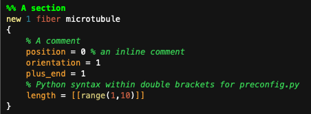
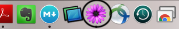
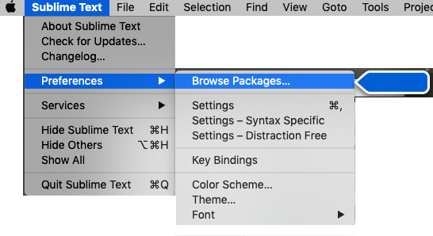

# Cytosim grammar

This is a text editor bundle with a grammar that provides syntax highlighting for [cytosim](https://gitlab.com/f.nedelec/cytosim). We provide a guide to install it in Textmate and Sublime Text. [Textmate](https://macromates.com/) is mac only, and [Sublime Text](https://www.sublimetext.com/) can be also installed in Windows and Linux.

When you include this bundle in your text editor, the grammar of files with the extension `.cym` and `.cym.tpl` will be changed to the grammar provided, that results in syntax highlighting as shown in here:

As you can see, it provides syntax highlighting, and allows for `%%` to produce a different kind of comment to define sections.

Furthermore, if you are using `preconfig.py`, it provides python syntax highlighting within sections in double square brackets.

Also, you can comment and uncomment lines using the usual shortcut `Cmd + /` in mac and `Ctrl + /` in windows.

## How to install it in textmate (mac):

Just drag the file `Cytosim.tmbundle` file into the icon of Textmate in the dock, and accept.

## How to install it in sublime text:
Go to `Preferences>Browse Packages`. It will open a file explorer window, which contains a folder called `User`. Copy the file `Cytosim.tmbundle` into the folder `User`.

